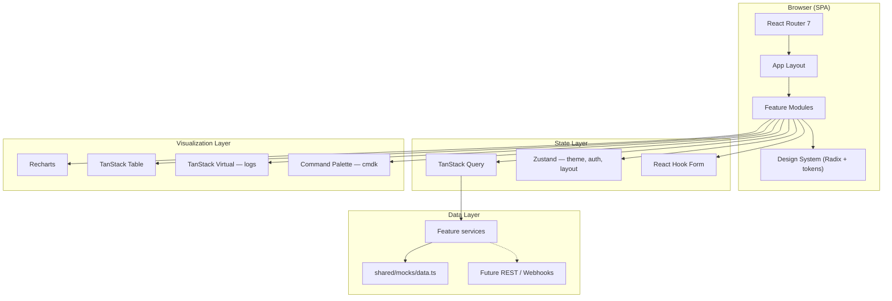

<div align="center">

# DevOps Monitor

**Plataforma de monitorización DevOps con calidad SaaS — portfolio de ingeniería frontend avanzada.**

Supervisa proyectos, despliegues, pipelines, builds, métricas, logs y alertas con una experiencia inspirada en Vercel Dashboard, GitHub Actions y Datadog — con identidad propia.

<br />

<!-- SYNC:VERSION_BADGES_START -->


<!-- SYNC:VERSION_BADGES_END -->

<br />


<br />

[**Demo en vivo**](#demo) · [**Instalación**](#instalación) · [**Arquitectura**](#arquitectura) · [**Contribuir**](#contribución)

</div>

---

## Descripción

### El problema

Monitorizar el ciclo de vida de aplicaciones (CI/CD, despliegues, logs, alertas) suele requerir saltar entre herramientas dispares con UX inconsistente. Para un portfolio de frontend avanzado hace falta una SPA que unifique **dashboards**, **tablas densas**, **gráficos**, **logs virtualizados** y **búsqueda global** — con arquitectura lista para conectar APIs reales.

### Por qué existe

**DevOps Monitor** es un proyecto portfolio de referencia: demostrar construcción de una plataforma de observabilidad con estándares de producción — arquitectura por features, TanStack Table/Virtual, Recharts, command palette, mock services API-ready — sin backend en la primera fase.

### Enfoque

| Principio              | Aplicación                                                                                          |
| ---------------------- | --------------------------------------------------------------------------------------------------- |
| **Frontend-first**     | Capa mock con misma interfaz que API futura; swap sin reescribir UI                                  |
| **Feature-based**      | Dominios (`projects`, `deployments`, `pipelines`, `logs`…) con ownership claro                      |
| **Data-dense UX**      | Tablas sortables, gráficos, timeline, log viewer virtualizado                                       |
| **Calidad invisible**  | Dark/light/system theme, estados loading/empty/error, rutas lazy-loaded                             |
| **IA como acelerador** | Agentes especializados aceleran desarrollo; arquitectura y revisión siguen siendo ingeniería humana |
| **Documento vivo**     | SSOT en `.claude/doc/`; roadmap por fases actualizado                                               |

---

## Características principales

### Implementadas

<!-- SYNC:IMPLEMENTED_FEATURES_START -->

- ✅ **activity** — Feed de actividad del equipo con formato por tipo de evento
- ✅ **alerts** — Lista de alertas con severidad, estado y filtrado
- ✅ **auth** — Autenticación mock con sesión persistente en localStorage
- ✅ **builds** — Historial de builds con branch, commit y duración
- ✅ **dashboard** — KPIs, gráficos Recharts y actividad reciente
- ✅ **deployments** — Historial de despliegues, estado y vista detalle con timeline
- ✅ **logs** — Visor de logs virtualizado con filtros por nivel y búsqueda
- ✅ **metrics** — Métricas por proyecto con gráficos de tendencia
- ✅ **pipelines** — Visualización de etapas CI/CD y estado por stage
- ✅ **projects** — Listado y detalle de proyectos monitorizados
- ✅ **search** — Búsqueda global scoped + command palette (⌘K)
- ✅ **settings** — Perfil, tema claro/oscuro/sistema y preferencias

<!-- SYNC:IMPLEMENTED_FEATURES_END -->

### Próximamente

- 🔲 Flujo de acknowledgment de alertas
- 🔲 Centro de notificaciones in-app
- 🔲 Timeline unificada con correlación de eventos
- 🔲 Auditoría de accesibilidad WCAG 2.1 AA completa
- 🔲 Cobertura de tests ampliada
- 🔲 API real e integración con proveedores CI/CD (requiere aprobación)
- 🔲 Asistente IA para análisis de logs (mock → LLM real)

---

## Demo

| Recurso                   | Enlace                                                                                 |
| ------------------------- | -------------------------------------------------------------------------------------- |
| **Aplicación desplegada** | _Próximamente — [Vercel](https://vercel.com)_                                          |
| **Repositorio**           | [github.com/PerecerDev/DevOps-Monitor](https://github.com/PerecerDev/DevOps-Monitor)   |

**Credenciales de demo (entorno local):**

```
Email:    alex@devopsmonitor.io
Password: demo1234
```

---

## Tecnologías

<table>
<tr><th>Categoría</th><th>Stack</th></tr>
<tr><td><strong>Frontend</strong></td><td>React 19, TypeScript 5.8, Vite 6, Tailwind CSS 4</td></tr>
<tr><td><strong>Estado</strong></td><td>TanStack Query 5 (server/async), Zustand 5 (tema, layout, auth)</td></tr>
<tr><td><strong>Routing</strong></td><td>React Router 7 — lazy routes y rutas protegidas</td></tr>
<tr><td><strong>Tablas</strong></td><td>TanStack Table 8 — sorting, filtering, column defs</td></tr>
<tr><td><strong>Virtualización</strong></td><td>TanStack Virtual 3 — log viewer de alto volumen</td></tr>
<tr><td><strong>Gráficos</strong></td><td>Recharts 2 — métricas, KPIs, tendencias</td></tr>
<tr><td><strong>UI</strong></td><td>Radix UI primitives, Lucide, cmdk, Framer Motion, date-fns</td></tr>
<tr><td><strong>Formularios</strong></td><td>React Hook Form + Zod + @hookform/resolvers</td></tr>
<tr><td><strong>Testing</strong></td><td>Vitest 3, React Testing Library, jsdom, coverage v8</td></tr>
<tr><td><strong>Calidad</strong></td><td>ESLint 9, Prettier 3, Husky 9, lint-staged 16</td></tr>
<tr><td><strong>IA (desarrollo)</strong></td><td>Cursor, Claude Code, agentes en `.claude/agents/`, MCP</td></tr>
<tr><td><strong>Deployment</strong></td><td>Vercel (SPA), GitHub Actions (CI)</td></tr>
</table>

---

## Arquitectura

DevOps Monitor sigue una **arquitectura por features** con capa de servicios mock API-ready:

```
UI → hooks → TanStack Query → services → mock API (futuro: HTTP)
         ↓
   invalidación de caché → actualización de UI
```



**Reglas clave:**

- Features consumen primitivos de `shared/components/ui/` — sin colores hardcodeados.
- Mock services en `shared/mocks/` comparten interfaz con la API futura.
- Code splitting manual: vendor, query, charts, table.
- Tokens semánticos en `src/styles/globals.css` para light/dark/system.

Ver [ARCHITECTURE.md](ARCHITECTURE.md) y [`.claude/doc/TECH_ARCHITECTURE.md`](.claude/doc/TECH_ARCHITECTURE.md).

---

## Estructura de carpetas

```
devops-monitor/
├── .claude/
│   ├── agents/              # Agentes IA especializados
│   ├── doc/                 # SSOT producto y arquitectura
│   └── plans/               # Planes de feature
├── .github/workflows/       # CI
├── docs/assets/             # Capturas para README
├── src/
│   ├── app/                 # Bootstrap, router, layout, providers
│   ├── features/            # Módulos de dominio
│   │   ├── activity/
│   │   ├── alerts/
│   │   ├── auth/
│   │   ├── builds/
│   │   ├── dashboard/
│   │   ├── deployments/
│   │   ├── logs/
│   │   ├── metrics/
│   │   ├── pipelines/
│   │   ├── projects/
│   │   ├── search/
│   │   └── settings/
│   ├── shared/              # Design system, mocks, hooks, utils
│   ├── styles/              # globals.css y tokens
│   └── test/                # Setup de Vitest
├── vercel.json              # SPA fallback routing
├── ARCHITECTURE.md
├── ROADMAP.md
└── package.json
```

| Directorio                    | Propósito                                      |
| ----------------------------- | ---------------------------------------------- |
| `src/shared/mocks/data.ts`    | Datos semilla, usuarios y credenciales demo    |
| `src/features/logs/`          | Log viewer virtualizado con filtros            |
| `src/features/search/`        | Command palette + búsqueda scoped              |
| `src/shared/components/ui/`   | Primitivos Radix-based del design system       |

---

## Instalación

### Requisitos previos

- **Node.js** 20+ (Node 22 LTS recomendado)
- **npm** 10+

### Pasos

1. **Clona el repositorio**

   ```bash
   git clone https://github.com/PerecerDev/DevOps-Monitor.git
   cd DevOps-Monitor
   ```

2. **Instala dependencias**

   ```bash
   npm install
   ```

3. **Arranca el servidor de desarrollo**

   ```bash
   npm run dev
   ```

4. Abre [http://localhost:5173](http://localhost:5173) e inicia sesión con las [credenciales de demo](#demo).

Validación completa:

```bash
npm run typecheck && npm run lint && npm run test:run && npm run build
```

---

## Scripts disponibles

| Script       | Comando              | Descripción                                    |
| ------------ | -------------------- | ---------------------------------------------- |
| Desarrollo   | `npm run dev`        | Servidor Vite con HMR                          |
| Build        | `npm run build`      | Typecheck + bundle de producción               |
| Preview      | `npm run preview`    | Sirve el build local                           |
| Tests        | `npm run test`       | Vitest en modo watch                           |
| Tests CI     | `npm run test:run`   | Vitest una ejecución (CI)                      |
| Coverage     | `npm run test:coverage` | Informe de cobertura                        |
| Lint         | `npm run lint`       | ESLint                                         |
| Lint fix     | `npm run lint:fix`   | ESLint con auto-fix                            |
| Format       | `npm run format`     | Prettier en src y raíz                         |
| Format check | `npm run format:check` | Verifica formato (CI)                        |
| Typecheck    | `npm run typecheck`  | Validación estricta TypeScript                 |

---

## Flujo de desarrollo

### Ramas

- **Nunca desarrollar en `main`**
- Prefijos: `feature/*`, `fix/*`, `refactor/*`, `docs/*`, `test/*`, `ci/*`, `chore/*`
- **Conventional Commits** obligatorios

Ver [`.claude/doc/GIT_STRATEGY.md`](.claude/doc/GIT_STRATEGY.md) y [CONTRIBUTING.md](CONTRIBUTING.md).

### Pull Requests

- [ ] Resumen y contexto
- [ ] Capturas/video para UI (claro/oscuro/sistema)
- [ ] Tests para servicios o componentes nuevos
- [ ] CI en verde

---

## Testing

**Filosofía:** probar servicios mock, utilidades puras y componentes con interacción observable.

| Nivel      | Herramienta  | Alcance                                    |
| ---------- | ------------ | ------------------------------------------ |
| Unitario   | Vitest       | Helpers, formatters, schemas Zod           |
| Componente | RTL + Vitest | Design system, auth flow                   |
| Integración| RTL          | Dashboard → project detail (planificado)   |

```bash
npm run test:run      # CI
npm run test          # watch
npm run test:coverage
```

---

## Calidad del código

| Herramienta        | Rol                                    |
| ------------------ | -------------------------------------- |
| **ESLint 9**       | TypeScript + React Hooks               |
| **Prettier 3**     | Formato; plugin Tailwind v4            |
| **Husky + lint-staged** | Pre-commit en staged files        |
| **GitHub Actions** | typecheck → lint → format:check → test → build |

---

## IA en el desarrollo

Este proyecto utiliza IA como **acelerador de ingeniería**:

| Herramienta              | Uso                                              |
| ------------------------ | ------------------------------------------------ |
| **Cursor / Claude Code** | IDE agéntico con reglas del proyecto             |
| **`.claude/agents/`**    | Roles UX, arquitectura, frontend, QA, seguridad… |
| **MCP**                  | Render, Vercel para despliegue e infraestructura |

> Roadmap incluye hooks de **AI assist** para análisis de logs — actualmente mock; integración LLM real requiere aprobación.

---

## Roadmap

| Fase       | Objetivo                                              | Estado         |
| ---------- | ----------------------------------------------------- | -------------- |
| **Fase 1** | Scaffold, auth, dashboard, módulos core, CI           | ✅ Completado  |
| **Fase 2** | TanStack Table, Recharts, métricas, deployment detail | ✅ Completado  |
| **Fase 3** | Logs virtualizados, command palette, búsqueda global  | ✅ Completado  |
| **Fase 4** | Alert acknowledgment, notification center             | 📋 Planificado |
| **Fase 5** | Timeline unificada, correlación de eventos           | 📋 Planificado |
| **Fase 6** | Polish, a11y audit, performance, error boundaries     | 📋 Planificado |
| **Fase 7** | Estadísticas avanzadas, AI assist, API real           | 📋 Planificado |

Ver [ROADMAP.md](ROADMAP.md).

---

## Decisiones técnicas

| Decisión       | Elección                          | Motivo                                           |
| -------------- | --------------------------------- | ------------------------------------------------ |
| Arquitectura   | Feature-based modules             | Escalabilidad; portfolio legible por dominio     |
| Server state   | TanStack Query                    | Caché, mutations — listo para polling/webhooks   |
| Tablas densas  | TanStack Table                    | Sort/filter sin reinventar DataGrid              |
| Logs           | TanStack Virtual                  | Miles de líneas sin bloquear el main thread      |
| Gráficos       | Recharts                          | Composable; suficiente para dashboards portfolio |
| Command palette| cmdk                              | Navegación rápida entre entidades DevOps         |
| Mock layer     | `shared/mocks/data.ts` centralizado | Single source para demo y tests               |
| Deploy         | Vercel static SPA                 | Zero-config; previews en PR                      |

---

## Deployment

Configurado para [Vercel](https://vercel.com) con routing SPA vía `vercel.json`:

```bash
npm run build
```

---

## Mantener el README actualizado

Secciones `<!-- SYNC:... -->` preparadas para sincronización de badges, features y métricas.

<!-- SYNC:PROJECT_STATS_START -->

| Métrica                    | Valor      |
| -------------------------- | ---------- |
| Versión                    | `0.1.0`    |
| Módulos en `src/features/` | 12         |
| Archivos de test           | 4          |
| Última sincronización      | 2026-07-04 |

<!-- SYNC:PROJECT_STATS_END -->

---

## Contribución

1. Abre un **issue** describiendo el problema o mejora
2. Alineación de scope (API real, integraciones CI/CD externas)
3. Rama desde `main`
4. CI local en verde
5. **Pull Request** con evidencia visual para cambios de UI

---

## Licencia

Distribuido bajo licencia **MIT** _(pendiente de añadir archivo LICENSE)_.

---

<div align="center">

Construido con disciplina de ingeniería frontend y un equipo de agentes IA orquestados.

**[⬆ Volver arriba](#devops-monitor)**

</div>
